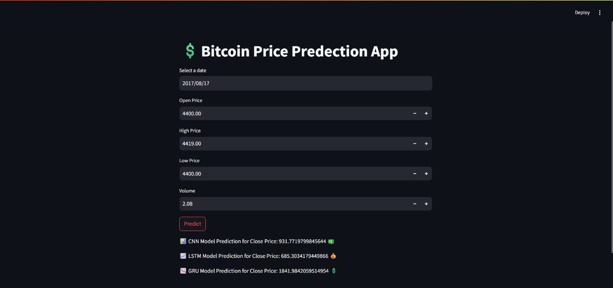
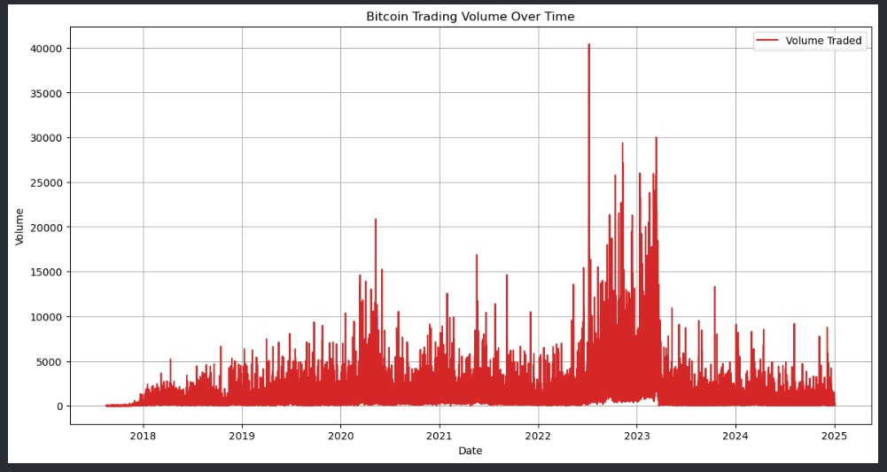
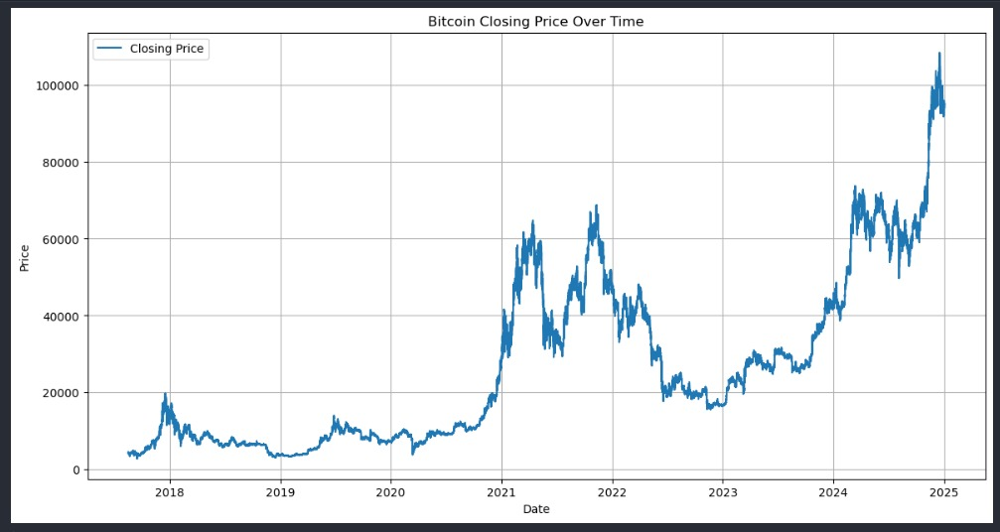
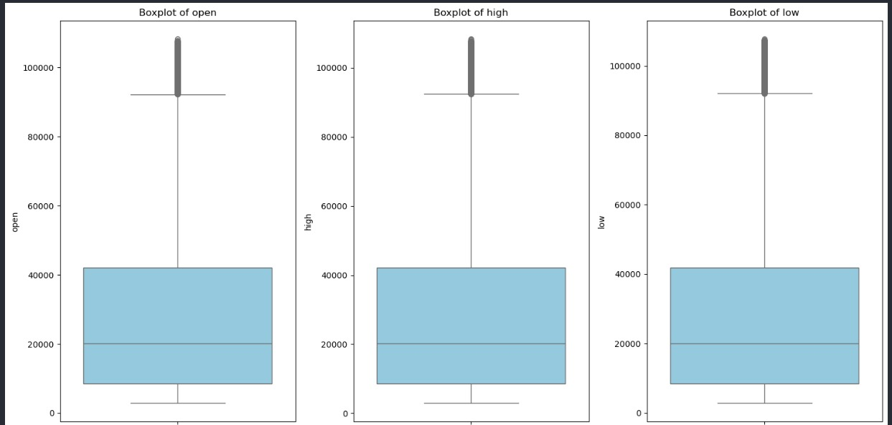
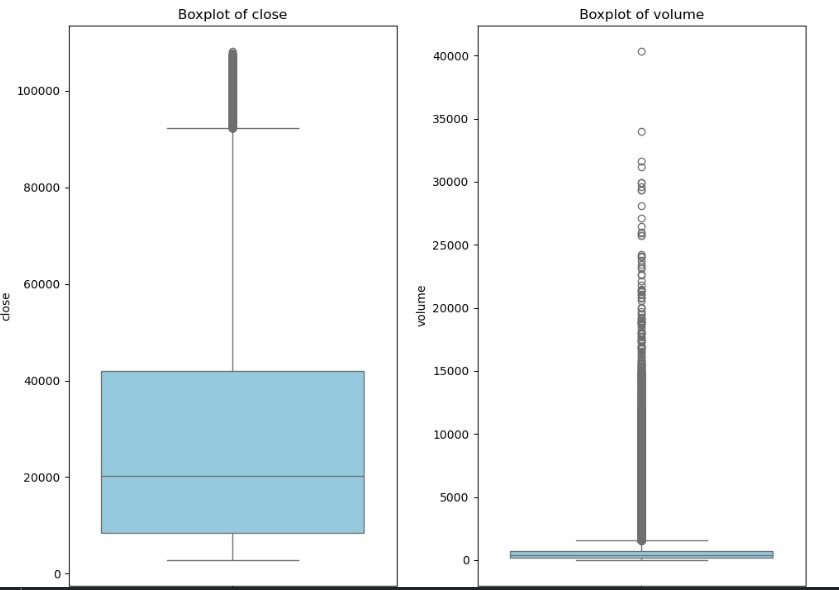

# 💲 Bitcoin Price Prediction with Deep Learning & Streamlit Web App

This project implements three different deep learning models (CNN, LSTM, GRU) to predict Bitcoin prices using historical OHLCV data. The project includes both a comprehensive training pipeline and an **interactive Streamlit web application** for real-time price predictions.

## 🌟 Features

- **🚀 Interactive Web App**: User-friendly Streamlit interface for real-time predictions
- **🧠 Multiple Model Architectures**: CNN, LSTM, GRU models
- **⚡ Real-time Predictions**: Input OHLCV data and get instant price predictions
- **📊 Model Comparison**: Compare predictions from all three models
- **🔧 Modular Design**: Easy to extend and modify individual components
- **📈 Comprehensive Training Pipeline**: Complete data preprocessing and model training

## This project was collaboratively developed by:

- **Mahmoud Emad Khairy**
- **Ammar Ahmed Farag**
- **Mostafa Mohamed Abdullah**

## 📧 Contact & Support

- 🐙 **GitHub**: [mahmoud554377](https://github.com/mahmoud554377)
- 🐙 **GitHub**: [ammarelbordeny](https://github.com/ammarelbordeny)
- 🐙 **GitHub**: [HagAli22](https://github.com/HagAli22)

## 📁 Project Structure

```
bitcoin_price_prediction/
├── data/
│   ├── raw/
│   │   └── BTC_USDT_ohlcv_data.parquet
│   └── processed/
│       └── BTC_USDT_ohlcv_data.csv
├── models/
│   ├── cnn/
│   │   ├── cnn_model.py           # CNN model architecture
│   │   ├── train_cnn.py          # CNN training script
│   │   ├── predict_cnn.py        # CNN prediction script
│   │   └── saved_models/         # Saved CNN models
│   ├── lstm/
│   │   ├── lstm_model.py         # LSTM model architecture
│   │   ├── train_lstm.py         # LSTM training script
│   │   ├── predict_lstm.py       # LSTM prediction script
│   │   └── saved_models/         # Saved LSTM models
│   ├── gru/
│   │   ├── gru_model.py          # GRU model architecture
│   │   ├── train_gru.py          # GRU training script
│   │   ├── predict_gru.py        # GRU prediction script
│   │   └── saved_models/         # Saved GRU models
│   └── ensemble/
│       ├── ensemble_model.py     # Ensemble model architecture
│       ├── train_ensemble.py     # Ensemble training script
│       └── predict_ensemble.py   # Ensemble prediction script
├── utils/
│   ├── __init__.py
│   ├── data_preprocessing.py     # Data preprocessing utilities
│   ├── visualization.py         # Visualization utilities
│   └── evaluation.py            # Model evaluation utilities
├── config/
│   └── config.py                # Configuration parameters
├── notebooks/
│   └── exploration.ipynb        # Original exploration notebook
├── app.py                       # 🌟 Streamlit Web Application
├── scaler.pkl                  # Saved data scaler
├── requirements.txt            # Python dependencies
└── README.md                   # This file
```
## Models Implemented & Performance

## 📊 Model Comparison Table

| Model | Test R² | Validation R² | Test Loss | Val Loss | Notes |
|-------|---------|---------------|-----------|----------|-------|
| 🧠 CNN | 0.936 | 0.693 | 0.002 | 0.001 | Strong on patterns, overfitting signs |
| 📈 LSTM | 0.910 | 0.870 | 0.003 | 0.0002 | Best generalization |
| 📉 GRU | 0.862 | 0.737 | 0.005 | 0.0005 | Lightweight & reliable |

## 🚀 Quick Start - Web Application

### 1. Install Dependencies
```bash
pip install -r requirements.txt
```

### 2. Run the Streamlit App
```bash
streamlit run app.py
```

### 3. Use the Web Interface
## 📱 Web Application Features


1. Open your browser to `http://localhost:8501`
2. Input Bitcoin OHLCV data:
   - **Date**: Select prediction date
   - **Open Price**: Opening price
   - **High Price**: Highest price  
   - **Low Price**: Lowest price
   - **Volume**: Trading volume
3. Click **"Predict"** to get price predictions from all models
4. View results from CNN, LSTM, and GRU models

## 📋 Installation & Setup

### Prerequisites
- Python 3.8 or higher
- pip package manager

### Installation Steps

1. **Clone the repository:**
```bash
git clone 
cd bitcoin_price_prediction
```

2. **Create a virtual environment:**
```bash
python -m venv venv
source venv/bin/activate  # On Windows: venv\Scripts\activate
```

3. **Install dependencies:**
```bash
pip install -r requirements.txt
```

4. **Ensure you have the trained models:**
   - `btc_cnn_model.pkl`
   - `btc_lstm_model.h5` 
   - `btc_gru_model.h5`
   - `scaler.pkl`
## 📈 Data Analysis & Visualizations

### Bitcoin Trading Volume Over Time


The trading volume analysis reveals:
- **Peak Activity**: Massive volume spikes during 2023 (up to 40,000+ units)
- **Market Cycles**: Volume correlates with major price movements
- **Volatility Indicator**: High volume periods coincide with market uncertainty

### Bitcoin Price Evolution (2018-2025)


Key price milestones:
- 🚀 **2021 Bull Run**: Reached ~$65,000
- 📉 **2022-2023 Correction**: Market consolidation around $15,000-$30,000
- 🌙 **2025 Surge**: Dramatic rise to over $100,000

### Statistical Distribution Analysis



The box plot analysis shows:
- **Price Distribution**: Open, High, Low, and Close prices show similar distributions with outliers above $100k
- **Volume Extremes**: Significant outliers in trading volume (up to 40,000+ units)
- **Market Behavior**: Typical cryptocurrency volatility patterns with long tails
- **Data Quality**: Clean data with expected financial time series characteristics


## 🎯 Usage Options

### Option 1: Web Application (Recommended)
```bash
streamlit run app.py
```

### Option 2: Individual Model Training

Train specific models:
```bash
# Train CNN model
cd models/cnn
python train_cnn.py

# Train LSTM model
cd models/lstm
python train_lstm.py

# Train GRU model
cd models/gru
python train_gru.py
```

### Option 3: Command Line Predictions

Make predictions with trained models:
```bash
# CNN predictions
cd models/cnn
python predict_cnn.py

# LSTM predictions
cd models/lstm
python predict_lstm.py

# GRU predictions
cd models/gru
python predict_gru.py
```

### Configuration

Modify `config/config.py` to adjust:
- Window size for time series sequences
- Model hyperparameters
- Training parameters
- File paths

## Data Requirements

The project expects Bitcoin OHLCV data with the following columns:
- `timestamp`: Date/time information
- `open`: Opening price
- `high`: Highest price
- `low`: Lowest price
- `close`: Closing price (target variable)
- `volume`: Trading volume

## Model Architectures

### CNN Model
- Two 1D convolutional layers with max pooling
- Dropout layers for regularization
- Dense layers for final prediction

### LSTM Model
- Two LSTM layers with return sequences
- Dropout layers for regularization
- Dense layers for final prediction

### GRU Model
- Two GRU layers with return sequences
- Dropout layers for regularization
- Dense layers for final prediction

### Ensemble Model
- Voting regressor combining LSTM and GRU
- Provides uncertainty estimation through model disagreement

## Evaluation Metrics

- **R² Score**: Coefficient of determination
- **MSE**: Mean Squared Error
- **MAE**: Mean Absolute Error
- **RMSE**: Root Mean Squared Error

## Visualization

The project includes comprehensive visualizations:
- Price and volume time series plots
- Training history plots
- Prediction vs actual value plots
- Model comparison plots

## Dependencies

Key dependencies include:
- TensorFlow/Keras for deep learning
- scikit-learn for preprocessing and ensemble methods
- pandas for data manipulation
- matplotlib/seaborn for visualization
- joblib for model persistence

## License

This project is provided as-is for educational and research purposes.

## Contributing

Feel free to open issues or submit pull requests for improvements.

---

# requirements.txt

tensorflow>=2.10.0
scikit-learn>=1.1.0
pandas>=1.5.0
numpy>=1.21.0
matplotlib>=3.5.0
seaborn>=0.11.0
joblib>=1.1.0
scikeras>=0.10.0

---